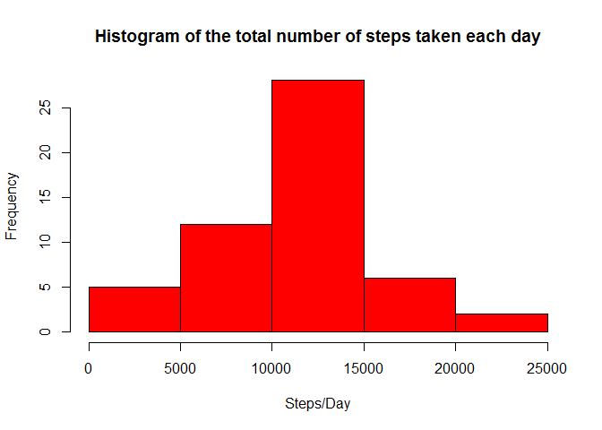
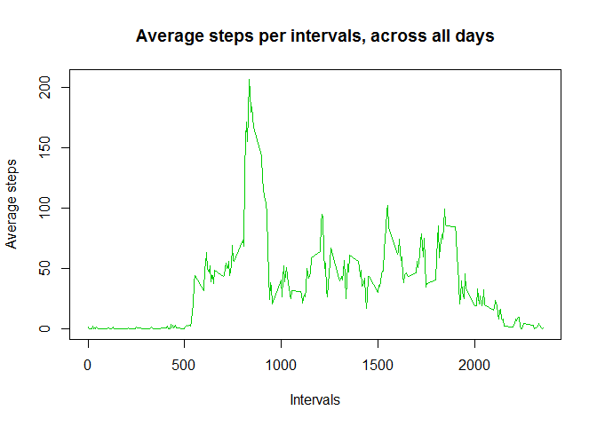
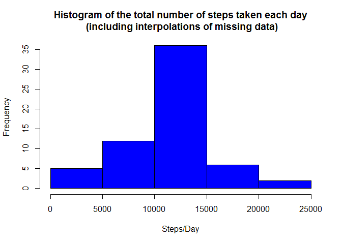
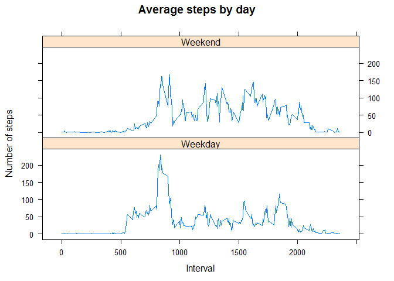

# Reproducible Research: Peer Assessment 1
Setting a few global options

```r
library(knitr)
```

```
## Warning: package 'knitr' was built under R version 3.2.3
```

```r
knitr::opts_chunk$set(echo = TRUE, results = "asis", fig.path = "instructions_fig/", warning = FALSE, message = FALSE)
```

## Loading and preprocessing the data

Setting working directory and checking zip data file is present

```r
setwd("~/Coursera/DataProject5_1/RepData_PeerAssessment1")
```

Unzipping the data file and confirming those unzipped files are present.

```r
if (!file.exists("activity.csv")) { 
        unzip("activity.zip")
} else {print("Data has already been unzipped")}
```

[1] "Data has already been unzipped"

```r
list.files()
```

 [1] "activity.csv"        "activity.zip"        "doc"                
 [4] "instructions_fig"    "PA1_template.html"   "PA1_template.md"    
 [7] "PA1_template.Rmd"    "PA1_template_cache"  "PA1_template_files" 
[10] "PA1_template1_cache" "README.md"          

Reading the unzipped data into a dataframe

```r
data <- read.csv("activity.csv")
```

Quick exploration of the data

```r
rnum <- nrow(data)
vars <- names(data)
varlength <- length(data)
```

* The __dataframe__ has __3__ variables (columns) with __17568__ records (rows).
* The __variable names__ are __steps, date, interval__.

Convert the date variable into a date class variable

```r
data$date <- as.Date(data$date)
class(data$date)
```

[1] "Date"

## What is mean total number of steps taken per day?
1. Calculate the total number of steps taken per day


```r
tsteps <- data %>% group_by(date) %>% summarise(totalsteps = sum(steps)) 
```
2. Make a histogram of the total number of steps taken each day

```r
hist(tsteps$totalsteps, main="Histogram of the total number of steps taken each day", xlab="Steps/Day", col="red")
```



3. Calculate and report the mean and median of the total number of steps taken per day (and rounding up to 2 significant digits)

```r
meansteps <-format(round(mean(tsteps$totalsteps, na.rm=T), digits = 2), nsmall = 2)
mediansteps <-format(round(median(tsteps$totalsteps, na.rm=T), digits = 2), nsmall = 2)
```

* The __mean__ total number of steps taken per day is __10766.19__.
* The __median__ total number of steps taken per day is __10765.00__.

## What is the average daily activity pattern?
1. Make a time series plot (i.e. type = "l") of the 5-minute interval (x-axis) and the average number of steps taken, averaged across all days (y-axis)

```r
stepsInterval <- aggregate(steps ~ interval, data = data, mean, na.rm = TRUE)
plot(steps ~ interval, data = stepsInterval, type = "l", main = "Average steps per intervals, across all days", col = "green3", xlab = "Intervals", ylab = "Average steps")
```



2. Which 5-minute interval, on average across all the days in the dataset, contains the maximum number of steps?

```r
maxSteps <-stepsInterval[which.max(stepsInterval$steps), ]$interval
```

* The __maximum number of steps__ on average across all days is found in the __835th__ interval.

## Imputing missing values

Note that there are a number of days/intervals where there are missing values (coded as NA). The presence of missing days may introduce bias into some calculations or summaries of the data.

1. Calculate and report the total number of missing values in the dataset (i.e. the total number of rows with NAs)

```r
SumNA <- sum(is.na(data$steps))
```
* There are  __2304 rows with NAs__ in the activity dataset.

2. Devise a strategy for filling in all of the missing values in the dataset. The strategy does not need to be sophisticated. For example, you could use the mean/median for that day, or the mean for that 5-minute interval, etc.
* My stragegy involves replacing the missing __2304 NA__ values with mean number of steps taken per 5-minute interval (scripted below in point 3).

3. Create a new dataset that is equal to the original dataset but with the missing data filled in.

```r
isna<-is.na(data)
newdata<-data
newdata$steps[which(isna)]<-stepsInterval$steps[match(data$interval[which(isna)],data$interval)]
```

4. Make a histogram of the total number of steps taken each day and Calculate and report the mean and median total number of steps taken per day. Do these values differ from the estimates from the first part of the assignment? What is the impact of imputing missing data on the estimates of the total daily number of steps?


```r
newtsteps <- newdata %>% group_by(date) %>% summarise(totalsteps = sum(steps)) 
```

```r
hist(newtsteps$totalsteps, main="Histogram of the total number of steps taken each day\n (including interpolations of missing data)", xlab="Steps/Day", col="blue")
```



Calculating the new mean and medians (and rounding up to 2 significant digits)

```r
Newmeansteps <-format(round(mean(newtsteps$totalsteps), digits = 2), nsmall = 2)
Newmediansteps <-format(round(median(newtsteps$totalsteps), digits = 2), nsmall = 2)
diff <- as.numeric(format(round(as.numeric(Newmediansteps)-as.numeric(mediansteps),digits = 2), nsmall = 2))
```

* After replacing the missing values with the mean number of steps taken per 5-minute interval, the __new mean__ for the total number of steps taken per day is __10766.19__, remaining the same as the previously calculated mean of __10766.19__.
* The __new median__ total number of steps taken is now __10766.19__, which differs from the old median of __10765.00__ by only __1.19__. 
* When comparing the histograms from both version of the data, the 'filled-in' data set shows a higher frequcy (y-axis) of above 35 for total steps per day. This is probably a result of replacing the NAs with the average value of the same interval as theirs, which increases the frequency of each value of steps per day (x-axis), but shouldn't affect the distribution of the data (i.e. we didn't introduce any 'new' data).

## Are there differences in activity patterns between weekdays and weekends?

For this part the weekdays() function may be of some help here. Use the dataset with the filled-in missing values for this part.

1. Create a new factor variable in the dataset with two levels - "weekday" and "weekend" indicating whether a given date is a weekday or weekend day.

```r
newdata <- mutate(newdata, day = as.character(weekdays(as.Date(newdata$date))))
newdata$day<-as.factor(gsub("Monday|Tuesday|Wednesday|Thursday|Friday", "Weekday", newdata$day))
newdata$day<-as.factor(gsub("Saturday|Sunday", "Weekend", newdata$day))
```

2. Make a panel plot containing a time series plot (i.e. type = "l") of the 5-minute interval (x-axis) and the average number of steps taken, averaged across all weekday days or weekend days (y-axis). See the README file in the GitHub repository to see an example of what this plot should look like using simulated data.

```r
stepsInterval2 <- aggregate(steps ~ interval + day, data = newdata, mean)
```

```r
library(lattice)
## constructing plot
xyplot(steps ~ interval | day, data = stepsInterval2, type = "l", layout=c(1,2),  xlab = "Interval", ylab = "Number of steps", main = "Average steps by day")
```




